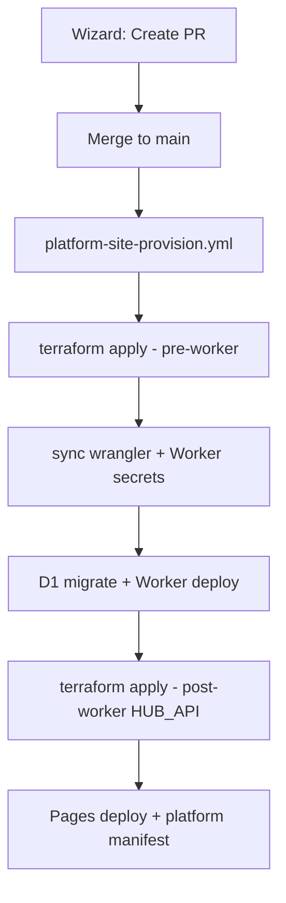

# Platform site provisioning (v4)

Fully automated hub creation after the site registry PR merges to `main`.

## Flow



1. **Wizard** dispatches `platform-site-manage.yml` → opens PR (registry + wrangler stubs).
2. **Merge PR** to `main`.
3. **Auto-trigger**: push to `main` changing `platform/sites.yaml` starts `platform-site-provision.yml` for each new site.
4. **Manual retry**: site card **Provision** button or workflow dispatch with `site_id`.

## One-time setup

### 1. Remote Terraform state (R2)

**Why:** Terraform state today lives on your laptop (`terraform/terraform.tfstate`). GitHub Actions cannot read that file, so automated provisioning needs state stored in **Cloudflare R2** (S3-compatible object storage).

**What you are doing:** create an R2 bucket, create an R2 API token, point Terraform at the bucket, then **copy** your existing local state into R2 once. After that, both your laptop and GitHub Actions use the same remote state.

---

#### Step A — Create the R2 bucket

1. Open [Cloudflare dashboard](https://dash.cloudflare.com) → **R2 object storage**.
2. Click **Create bucket**.
3. Name it something like `lovely-home-terraform-state` (globally unique within your account).
4. Leave other settings as default → **Create bucket**.

Write down the **bucket name** — you need it twice (local `backend.hcl` and GitHub secret `TF_STATE_R2_BUCKET`).

---

#### Step B — Create an R2 API token (for Terraform only)

This token is **separate** from your main `CLOUDFLARE_API_TOKEN`. It only accesses the state bucket.

1. R2 → **Manage R2 API tokens** (or **Overview** → **Manage API tokens**).
2. **Create API token**.
3. Name: e.g. `terraform-state`.
4. Permissions: **Object Read & Write** (admin on the state bucket is fine if offered).
5. Scope: restrict to the bucket you just created (recommended).
6. **Create API token**.

Cloudflare shows two values **once**:

| Cloudflare label | Used as |
|------------------|---------|
| **Access Key ID** | `AWS_ACCESS_KEY_ID` locally, GitHub secret `TF_STATE_R2_ACCESS_KEY_ID` |
| **Secret Access Key** | `AWS_SECRET_ACCESS_KEY` locally, GitHub secret `TF_STATE_R2_SECRET_ACCESS_KEY` |

Copy both somewhere safe now — the secret is not shown again.

---

#### Step C — Find your account ID (for the endpoint URL)

1. Dashboard → any zone → **Overview** → copy **Account ID** (32-character hex),  
   **or** Workers & Pages → overview sidebar.

Your R2 **endpoint** is always:

```text
https://<ACCOUNT_ID>.r2.cloudflarestorage.com
```

Example: account `2c810bbed7e633623b99ae7c51dd0aa2` →  
`https://2c810bbed7e633623b99ae7c51dd0aa2.r2.cloudflarestorage.com`

That URL goes in `backend.hcl` and GitHub secret `TF_STATE_R2_ENDPOINT`.

---

#### Step D — Create local `backend.hcl` (not committed)

From the repo root:

```bash
cp terraform/environments/backend.hcl.example terraform/environments/backend.hcl
```

Edit `terraform/environments/backend.hcl` — replace only the two placeholders:

```hcl
bucket   = "lovely-home-terraform-state"   # Step A bucket name
endpoint = "https://2c810bbed7e633623b99ae7c51dd0aa2.r2.cloudflarestorage.com"  # Step C
```

Leave `key`, `region`, and the `skip_*` lines as in the example.  
This file is **gitignored** — do not commit it.

---

#### Step E — Export R2 credentials in your terminal

Terraform’s S3 backend reads R2 tokens via **AWS-named** env vars (that is normal for R2):

```bash
export AWS_ACCESS_KEY_ID="paste Access Key ID from Step B"
export AWS_SECRET_ACCESS_KEY="paste Secret Access Key from Step B"
```

Optional sanity check (requires [AWS CLI](https://aws.amazon.com/cli/) configured the same way, or skip):

```bash
aws s3 ls s3://lovely-home-terraform-state \
  --endpoint-url "https://YOUR_ACCOUNT_ID.r2.cloudflarestorage.com"
```

---

#### Step F — Point Terraform at R2 and migrate state

You still need your usual Cloudflare token for the **provider** (resources), separate from the R2 token above:

```bash
export CLOUDFLARE_API_TOKEN="your existing terraform API token"
cd terraform
```

**Command 1 — configure the backend:**

```bash
terraform init -backend-config=environments/backend.hcl
```

Terraform downloads providers and configures the R2 backend. It may ask to copy existing local state — say **no** if prompted here; the next command handles migration explicitly.

**Command 2 — copy local state to R2 (one time only):**

```bash
terraform init -migrate-state
```

When prompted **“Do you want to copy existing state to the new backend?”** → type **`yes`**.

After success you should see state in R2 (dashboard → your bucket → object `home-dashboard/hub.tfstate`).

**Command 3 — verify nothing changed:**

```bash
terraform plan -var-file=environments/hub.tfvars
```

Expect **No changes** (or only minor drift you already know about). If the plan wants to recreate production resources, **stop** and ask for help before applying.

---

#### Step G — Add matching GitHub secrets

In GitHub → repo → **Settings** → **Secrets and variables** → **Actions**:

| GitHub secret | Value |
|---------------|-------|
| `TF_STATE_R2_BUCKET` | Bucket name from Step A |
| `TF_STATE_R2_ENDPOINT` | `https://<ACCOUNT_ID>.r2.cloudflarestorage.com` |
| `TF_STATE_R2_ACCESS_KEY_ID` | Access Key ID from Step B |
| `TF_STATE_R2_SECRET_ACCESS_KEY` | Secret Access Key from Step B |

CI uses these instead of `backend.hcl` (see `platform-site-provision-reusable.yml`).

---

#### After migration — day-to-day use

Local applies use the same backend automatically once `terraform init` has been run:

```bash
export AWS_ACCESS_KEY_ID="..."
export AWS_SECRET_ACCESS_KEY="..."
export CLOUDFLARE_API_TOKEN="..."
cd terraform
terraform plan -var-file=environments/hub.tfvars
terraform apply -var-file=environments/hub.tfvars
```

You no longer maintain a separate “CI only” state file — laptop and GitHub Actions share R2.

**Troubleshooting**

| Problem | Fix |
|---------|-----|
| `No valid credential sources` on init | Export `AWS_ACCESS_KEY_ID` / `AWS_SECRET_ACCESS_KEY` before `terraform init` |
| `Access Denied` on init | R2 token needs Object Read & Write on the state bucket |
| Plan wants to recreate everything | State file not migrated — re-run `terraform init -migrate-state` and confirm `yes` |
| `backend.hcl` not found | Run `cp` from Step D; file lives at `terraform/environments/backend.hcl` |

---

### 2. GitHub repository secrets (Cloudflare + app config)

| Secret | Purpose |
|--------|---------|
| `CLOUDFLARE_API_TOKEN` | Terraform + Wrangler (D1, R2, Pages, Workers, Access, DNS, **Workers Secrets**) |
| `CLOUDFLARE_ACCOUNT_ID` | Account ID |
| `CLOUDFLARE_ZONE_ID` | Zone ID for `lovely-home.co.uk` |
| `WORKERS_SUBDOMAIN` | e.g. `mark-lovely67` |
| `ACCESS_TEAM_DOMAIN` | Zero Trust team slug, e.g. `lovely-home` |
| `OWNER_EMAILS` | Comma-separated household owner emails |
| `PLATFORM_OPERATOR_EMAILS` | Comma-separated operator emails |
| `TF_STATE_R2_ACCESS_KEY_ID` | R2 API token access key |
| `TF_STATE_R2_SECRET_ACCESS_KEY` | R2 API token secret |
| `TF_STATE_R2_BUCKET` | R2 bucket name |
| `TF_STATE_R2_ENDPOINT` | `https://<account_id>.r2.cloudflarestorage.com` |

Optional:

| Secret | Purpose |
|--------|---------|
| `SITTER_EMAILS` | House-sitter Access emails |
| `PLATFORM_GITHUB_TOKEN` | Platform wizard token (also injected into generated tfvars for platform admin) |
| `HUB_PROXY_SECRETS_JSON` | `{"production":"...","test":"..."}` for imported sites with existing secrets |

### 3. Cloudflare API token permissions

The CI token needs everything in [platform-terraform.md](./platform-terraform.md) **plus**:

- Account → **Workers Scripts → Edit**
- Account → **Workers Secrets → Edit**

Without Workers Secrets, `set-worker-secrets-from-terraform.mjs` fails in CI.

## What runs in CI

[`scripts/provision-hub-site.mjs`](../scripts/provision-hub-site.mjs):

1. `generate-hub-tfvars.mjs` — builds tfvars from `platform/sites.yaml` + secrets (never committed)
2. `terraform apply` (attach_hub_api_binding=false for new site)
3. `sync-wrangler-from-terraform.mjs`
4. `set-worker-secrets-from-terraform.mjs` — HUB_PROXY_SECRET, Access AUD, vanilla dummy secrets
5. `npm run d1:migrate:<site>` + `npm run deploy:<site>`
6. Second `terraform apply` (attach_hub_api_binding=true)
7. `deploy-cloudflare-pages-site.sh`
8. `build-platform-manifest.mjs` + `deploy-platform-admin.sh`

## Local dry-run

After R2 backend is configured and secrets exported:

```bash
export CLOUDFLARE_API_TOKEN="..."
export CLOUDFLARE_ACCOUNT_ID="..."
export CLOUDFLARE_ZONE_ID="..."
export WORKERS_SUBDOMAIN="..."
export ACCESS_TEAM_DOMAIN="..."
export OWNER_EMAILS="owner@example.com"
export PLATFORM_OPERATOR_EMAILS="you@example.com"
export AWS_ACCESS_KEY_ID="..."   # R2
export AWS_SECRET_ACCESS_KEY="..."

cd terraform && terraform init -backend-config=environments/backend.hcl
cd ..
node scripts/provision-hub-site.mjs demo
```

## Workflows

| Workflow | Trigger |
|----------|---------|
| [`platform-site-manage.yml`](../.github/workflows/platform-site-manage.yml) | Wizard → PR |
| [`platform-site-provision.yml`](../.github/workflows/platform-site-provision.yml) | Push to `main` (sites.yaml) or manual / **Provision** button |
| [`platform-site-deploy.yml`](../.github/workflows/platform-site-deploy.yml) | Worker-only redeploy |

## Related

- [platform-admin.md](./platform-admin.md) — operator UI
- [platform-terraform.md](./platform-terraform.md) — Terraform resource details
