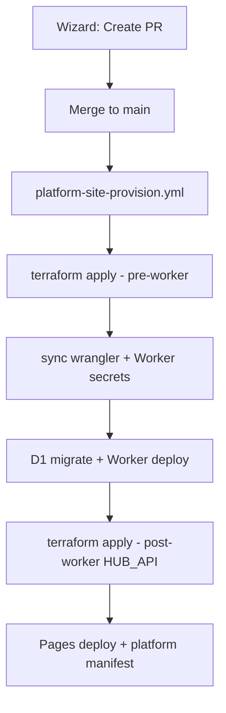

# Platform site provisioning (v4)

Fully automated hub creation after the site registry PR merges to `main`.

## Flow



1. **Wizard** dispatches `platform-site-manage.yml` → opens PR (registry + wrangler stubs).
2. **Merge PR** to `main`.
3. **Auto-trigger**: push to `main` changing `platform/sites.yaml` starts `platform-site-provision.yml` for each new site.
4. **Manual retry**: site card **Provision** button or workflow dispatch with `site_id`.

## One-time setup

### 1. Remote Terraform state (R2)

Local state cannot be used from GitHub Actions. Migrate once:

```bash
# Create R2 bucket + API token (Object Read & Write) in Cloudflare dashboard
cp terraform/environments/backend.hcl.example terraform/environments/backend.hcl
# Edit bucket + endpoint (https://<account_id>.r2.cloudflarestorage.com)

export AWS_ACCESS_KEY_ID="..."
export AWS_SECRET_ACCESS_KEY="..."

cd terraform
terraform init -backend-config=environments/backend.hcl
terraform init -migrate-state   # moves local .tfstate to R2
terraform plan -var-file=environments/hub.tfvars   # verify unchanged
```

### 2. GitHub repository secrets

| Secret | Purpose |
|--------|---------|
| `CLOUDFLARE_API_TOKEN` | Terraform + Wrangler (D1, R2, Pages, Workers, Access, DNS, **Workers Secrets**) |
| `CLOUDFLARE_ACCOUNT_ID` | Account ID |
| `CLOUDFLARE_ZONE_ID` | Zone ID for `lovely-home.co.uk` |
| `WORKERS_SUBDOMAIN` | e.g. `mark-lovely67` |
| `ACCESS_TEAM_DOMAIN` | Zero Trust team slug, e.g. `lovely-home` |
| `OWNER_EMAILS` | Comma-separated household owner emails |
| `PLATFORM_OPERATOR_EMAILS` | Comma-separated operator emails |
| `TF_STATE_R2_ACCESS_KEY_ID` | R2 API token access key |
| `TF_STATE_R2_SECRET_ACCESS_KEY` | R2 API token secret |
| `TF_STATE_R2_BUCKET` | R2 bucket name |
| `TF_STATE_R2_ENDPOINT` | `https://<account_id>.r2.cloudflarestorage.com` |

Optional:

| Secret | Purpose |
|--------|---------|
| `SITTER_EMAILS` | House-sitter Access emails |
| `PLATFORM_GITHUB_TOKEN` | Platform wizard token (also injected into generated tfvars for platform admin) |
| `HUB_PROXY_SECRETS_JSON` | `{"production":"...","test":"..."}` for imported sites with existing secrets |

### 3. Cloudflare API token permissions

The CI token needs everything in [platform-terraform.md](./platform-terraform.md) **plus**:

- Account → **Workers Scripts → Edit**
- Account → **Workers Secrets → Edit**

Without Workers Secrets, `set-worker-secrets-from-terraform.mjs` fails in CI.

## What runs in CI

[`scripts/provision-hub-site.mjs`](../scripts/provision-hub-site.mjs):

1. `generate-hub-tfvars.mjs` — builds tfvars from `platform/sites.yaml` + secrets (never committed)
2. `terraform apply` (attach_hub_api_binding=false for new site)
3. `sync-wrangler-from-terraform.mjs`
4. `set-worker-secrets-from-terraform.mjs` — HUB_PROXY_SECRET, Access AUD, vanilla dummy secrets
5. `npm run d1:migrate:<site>` + `npm run deploy:<site>`
6. Second `terraform apply` (attach_hub_api_binding=true)
7. `deploy-cloudflare-pages-site.sh`
8. `build-platform-manifest.mjs` + `deploy-platform-admin.sh`

## Local dry-run

After R2 backend is configured and secrets exported:

```bash
export CLOUDFLARE_API_TOKEN="..."
export CLOUDFLARE_ACCOUNT_ID="..."
export CLOUDFLARE_ZONE_ID="..."
export WORKERS_SUBDOMAIN="..."
export ACCESS_TEAM_DOMAIN="..."
export OWNER_EMAILS="owner@example.com"
export PLATFORM_OPERATOR_EMAILS="you@example.com"
export AWS_ACCESS_KEY_ID="..."   # R2
export AWS_SECRET_ACCESS_KEY="..."

cd terraform && terraform init -backend-config=environments/backend.hcl
cd ..
node scripts/provision-hub-site.mjs demo
```

## Workflows

| Workflow | Trigger |
|----------|---------|
| [`platform-site-manage.yml`](../.github/workflows/platform-site-manage.yml) | Wizard → PR |
| [`platform-site-provision.yml`](../.github/workflows/platform-site-provision.yml) | Push to `main` (sites.yaml) or manual / **Provision** button |
| [`platform-site-deploy.yml`](../.github/workflows/platform-site-deploy.yml) | Worker-only redeploy |

## Related

- [platform-admin.md](./platform-admin.md) — operator UI
- [platform-terraform.md](./platform-terraform.md) — Terraform resource details
