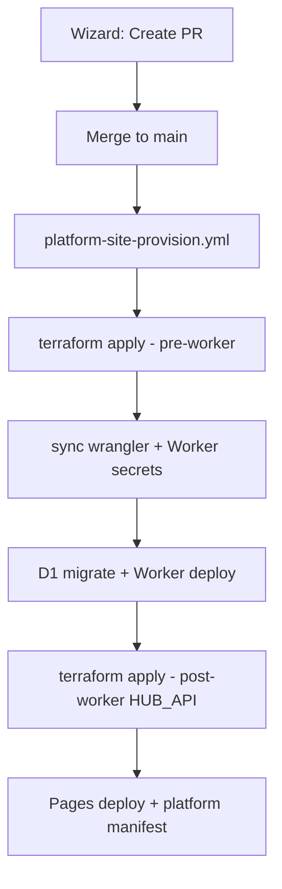
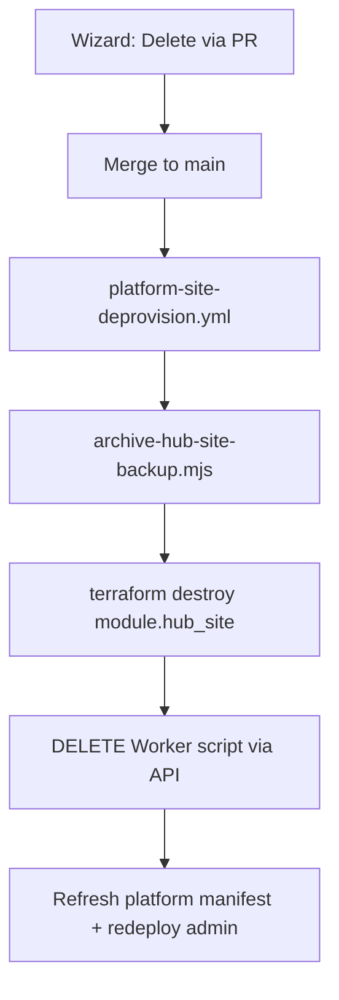

# Platform site provisioning (v4)

Fully automated hub creation after the site registry PR merges to `main`.

## Flow



1. **Wizard** dispatches `platform-site-manage.yml` → opens PR (registry + wrangler stubs).
2. **Merge PR** to `main`.
3. **Auto-trigger**: push to `main` changing `platform/sites.yaml` starts `platform-site-provision.yml` for each new site.
4. **Manual retry**: site card **Provision** button or workflow dispatch with `site_id`.

## One-time setup

### 1. Remote Terraform state (R2)

**Why:** Terraform state today lives on your laptop (`terraform/terraform.tfstate`). GitHub Actions cannot read that file, so automated provisioning needs state stored in **Cloudflare R2** (S3-compatible object storage).

**What you are doing:** create an R2 bucket, create an R2 API token, point Terraform at the bucket, then **copy** your existing local state into R2 once. After that, both your laptop and GitHub Actions use the same remote state.

---

#### Step A — Create the R2 bucket

1. Open [Cloudflare dashboard](https://dash.cloudflare.com) → **R2 object storage**.
2. Click **Create bucket**.
3. Name it something like `lovely-home-terraform-state` (globally unique within your account).
4. Leave other settings as default → **Create bucket**.

Write down the **bucket name** — you need it twice (local `backend.hcl` and GitHub secret `TF_STATE_R2_BUCKET`).

---

#### Step B — Create an R2 API token (for Terraform only)

This token is **separate** from your main `CLOUDFLARE_API_TOKEN`. It only accesses the state bucket.

1. R2 → **Manage R2 API tokens** (or **Overview** → **Manage API tokens**).
2. **Create API token**.
3. Name: e.g. `terraform-state`.
4. Permissions: **Object Read & Write** (admin on the state bucket is fine if offered).
5. Scope: restrict to the bucket you just created (recommended).
6. **Create API token**.

Cloudflare shows two values **once**:

| Cloudflare label | Used as |
|------------------|---------|
| **Access Key ID** | `AWS_ACCESS_KEY_ID` locally, GitHub secret `TF_STATE_R2_ACCESS_KEY_ID` |
| **Secret Access Key** | `AWS_SECRET_ACCESS_KEY` locally, GitHub secret `TF_STATE_R2_SECRET_ACCESS_KEY` |

Copy both somewhere safe now — the secret is not shown again.

---

#### Step C — Find your account ID (for the endpoint URL)

1. Dashboard → any zone → **Overview** → copy **Account ID** (32-character hex),  
   **or** Workers & Pages → overview sidebar.

Your R2 **endpoint** is always:

```text
https://<ACCOUNT_ID>.r2.cloudflarestorage.com
```

Example: account `2c810bbed7e633623b99ae7c51dd0aa2` →  
`https://2c810bbed7e633623b99ae7c51dd0aa2.r2.cloudflarestorage.com`

That URL goes in `backend.hcl` and GitHub secret `TF_STATE_R2_ENDPOINT`.

---

#### Step D — Create local `backend.hcl` (not committed)

From the repo root:

```bash
cp terraform/environments/backend.hcl.example terraform/environments/backend.hcl
```

Edit `terraform/environments/backend.hcl` — replace only the two placeholders:

```hcl
bucket   = "lovely-home-terraform-state"   # Step A bucket name
endpoints = {
  s3 = "https://2c810bbed7e633623b99ae7c51dd0aa2.r2.cloudflarestorage.com"  # Step C
}
```

Leave `key`, `region`, and the `skip_*` lines as in the example.  
This file is **gitignored** — do not commit it.

---

#### Step E — Export R2 credentials in your terminal

Terraform’s S3 backend reads R2 tokens via **AWS-named** env vars (that is normal for R2):

```bash
export AWS_ACCESS_KEY_ID="paste Access Key ID from Step B"
export AWS_SECRET_ACCESS_KEY="paste Secret Access Key from Step B"
```

Optional sanity check (requires [AWS CLI](https://aws.amazon.com/cli/) configured the same way, or skip):

```bash
aws s3 ls s3://lovely-home-terraform-state \
  --endpoint-url "https://YOUR_ACCOUNT_ID.r2.cloudflarestorage.com"
```

---

#### Step F — Point Terraform at R2 and migrate state

You still need your usual Cloudflare token for the **provider** (resources), separate from the R2 token above:

```bash
export CLOUDFLARE_API_TOKEN="your existing terraform API token"
cd terraform
```

**Command 1 — configure the backend and migrate state:**

```bash
terraform init -backend-config=environments/backend.hcl
```

When prompted **“Do you want to copy existing state to the new backend?”** → type **`yes`**.

That single command both configures R2 **and** uploads your local `terraform.tfstate`. You do **not** need a second `terraform init -migrate-state` unless you answered `no` the first time.

**Command 2 — verify nothing changed:**

```bash
terraform plan -var-file=environments/hub.tfvars
```

Expect **No changes** (or only minor drift you already know about). If the plan wants to recreate production resources, **stop** and ask for help before applying.

---

#### Step G — Add matching GitHub secrets

In GitHub → repo → **Settings** → **Secrets and variables** → **Actions**:

| GitHub secret | Value |
|---------------|-------|
| `TF_STATE_R2_BUCKET` | Bucket name from Step A |
| `TF_STATE_R2_ENDPOINT` | `https://<ACCOUNT_ID>.r2.cloudflarestorage.com` |
| `TF_STATE_R2_ACCESS_KEY_ID` | Access Key ID from Step B |
| `TF_STATE_R2_SECRET_ACCESS_KEY` | Secret Access Key from Step B |

CI uses these instead of `backend.hcl` (see `platform-site-provision-reusable.yml`).

---

#### After migration — day-to-day use

Local applies use the same backend automatically once `terraform init` has been run:

```bash
export AWS_ACCESS_KEY_ID="..."
export AWS_SECRET_ACCESS_KEY="..."
export CLOUDFLARE_API_TOKEN="..."
cd terraform
terraform plan -var-file=environments/hub.tfvars
terraform apply -var-file=environments/hub.tfvars
```

You no longer maintain a separate “CI only” state file — laptop and GitHub Actions share R2.

**Troubleshooting**

| Problem | Fix |
|---------|-----|
| `No valid credential sources` on init | Export `AWS_ACCESS_KEY_ID` / `AWS_SECRET_ACCESS_KEY` before `terraform init` |
| `Access Denied` on init | R2 token needs Object Read & Write on the state bucket |
| Plan wants to recreate everything | State file not migrated — re-run `terraform init -migrate-state` and confirm `yes` |
| `backend.hcl` not found | Run `cp` from Step D; file lives at `terraform/environments/backend.hcl` |

---

### 2. GitHub repository secrets (Cloudflare + app config)

| Secret | Purpose |
|--------|---------|
| `CLOUDFLARE_API_TOKEN` | Terraform + Wrangler (D1, R2, Pages, Workers, Access, DNS, **Workers Scripts** for deploy + secrets) |
| `CLOUDFLARE_ACCOUNT_ID` | Account ID |
| `CLOUDFLARE_ZONE_ID` | Zone ID for `lovely-home.co.uk` |
| `WORKERS_SUBDOMAIN` | e.g. `mark-lovely67` |
| `ACCESS_TEAM_DOMAIN` | Zero Trust team slug, e.g. `lovely-home` |
| `PLATFORM_OPERATOR_EMAILS` | Comma-separated operator emails |
| `TF_STATE_R2_ACCESS_KEY_ID` | R2 API token access key |
| `TF_STATE_R2_SECRET_ACCESS_KEY` | R2 API token secret |
| `TF_STATE_R2_BUCKET` | R2 bucket name |
| `TF_STATE_R2_ENDPOINT` | `https://<account_id>.r2.cloudflarestorage.com` |

Optional (strongly recommended — required for wizard PRs unless you enable Actions PR creation in repo settings):

| Secret | Purpose |
|--------|---------|
| `OWNER_EMAILS` | Optional fallback when a site has no `owner_emails` in `platform/sites.yaml` (legacy production/test/sandbox) |
| `SITTER_EMAILS` | Optional fallback when a site has no `sitter_emails` in the registry |
| `CF_ACCESS_MANAGEMENT_TOKEN` | Optional dedicated token for hub Settings sitter-email sync (defaults to `CLOUDFLARE_API_TOKEN` in CI) |
| `PLATFORM_GITHUB_TOKEN` | Same PAT as platform admin Pages env — **must also be a GitHub Actions repo secret** so site-manage can open PRs, provision can open the post-provision follow-up PR, and deprovision can prune `HUB_PROXY_SECRETS_JSON` (needs **repo secrets** write) |
| `PLATFORM_CF_API_TOKEN` | Same token as platform admin Pages env (optional — usage + preview toggles) |
| `STRIPE_SECRET_KEY` | Same as `stripe_secret_key` in hub.tfvars — **required for billing** or CI terraform apply strips Stripe vars from platform Pages |
| `STRIPE_WEBHOOK_SECRET` | Same as `stripe_webhook_secret` in hub.tfvars |
| `STRIPE_PRICE_ID` | Same as `stripe_price_id` in hub.tfvars |
| `HUB_PROXY_SECRETS_JSON` | `{"production":"...","test":"..."}` — only needed if Terraform output is unavailable; CI normally reads secrets from remote state |

CI writes secrets to a separate sensitive var-file (`hub.generated.secrets.tfvars.json`, gitignored) so `hub_proxy_secret` values are not embedded in the main generated tfvars file or CI logs.

Provisioning runs **one site at a time** (`max-parallel: 1` + workflow concurrency) because R2 state locking does not use DynamoDB.

### 3. Cloudflare API token permissions

The CI token needs everything in [platform-terraform.md](./platform-terraform.md) **plus**:

- Account → **Workers Scripts → Edit** (deploy Worker + `wrangler secret put`)
- Zone → **Workers Routes → Edit** (wrangler deploy enables `*.workers.dev` after upload)

Without Workers Scripts Edit, `set-worker-secrets-from-terraform.mjs` fails in CI. Without Workers Routes Edit, `wrangler deploy` fails on `/workers/subdomain` even when the script upload succeeds.

**Provision fails with `401 Unauthorized` (Access, D1, R2 create):** The GitHub secret `CLOUDFLARE_API_TOKEN` is invalid, expired, or does not include account `CLOUDFLARE_ACCOUNT_ID`. Re-create the token with the permissions above, update the repo secret, and run locally or in CI:

```bash
export CLOUDFLARE_API_TOKEN="..."
export CLOUDFLARE_ACCOUNT_ID="..."
export CLOUDFLARE_ZONE_ID="..."
bash scripts/verify-cloudflare-api-token.sh
```

**Deploy fails with `Authentication error [code: 10000]` on `/workers/subdomain`:** Add **Workers Routes → Edit** on zone `lovely-home.co.uk` (included in Cloudflare’s “Edit Cloudflare Workers” template). Re-run verify — it checks the subdomain endpoint before terraform apply.

**Post-worker apply fails with `Invalid Service name ()` (8000022):** CI runs `scripts/attach-hub-api-pages-binding.mjs` (direct Cloudflare API) then redeploys Pages so the binding is active. Local: `bash scripts/deploy-cloudflare-pages-site.sh <site_id>` after Worker deploy.

**Platform admin shows `HUB_API binding no` after provision:** The binding is project-level; the **active** Pages deployment must be created after attach. `deploy-cloudflare-pages-site.sh` attaches then redeploys automatically. Re-run that script or **Platform site deploy** for the site.

**Terraform apply fails with Access `400 Bad Request` / `domain does not belong to zone` on a new site:** The Pages Access app includes `*.pages.dev` destinations, which Cloudflare rejects until the Pages project exists. CI now omits those destinations during the pre-worker apply and adds them on the post-worker apply. Merge the fix and re-run **Platform site provision** (workflow dispatch with the site id). Partial applies resume safely on retry.

## What runs in CI

[`scripts/provision-hub-site.mjs`](../scripts/provision-hub-site.mjs):

1. `generate-hub-tfvars.mjs` — builds tfvars from `platform/sites.yaml` + secrets (never committed)
2. `terraform apply` (attach_hub_api_binding=false for new site)
3. `sync-wrangler-from-terraform.mjs`
4. `set-worker-secrets-from-terraform.mjs` — HUB_PROXY_SECRET, Access AUD, vanilla dummy secrets, optional `GOOGLE_PLACES_API_KEY` (address lookup)
5. `npm run d1:migrate:<site>` + `npm run deploy:<site>`
6. `terraform apply -refresh-only` (post-worker tfvars)
7. `deploy-cloudflare-pages-site.sh` — deploy, attach HUB_API, **redeploy** so binding is live
8. `enable-hub-pages-previews.mjs` (non-production sites)
9. `build-platform-manifest.mjs` + `deploy-platform-admin.sh`

## Local dry-run

After R2 backend is configured, export `CLOUDFLARE_API_TOKEN` (not stored in `hub.tfvars`). Other provision inputs are read from `terraform/environments/hub.tfvars` automatically when env vars are unset:

```bash
export CLOUDFLARE_API_TOKEN="..."
export AWS_ACCESS_KEY_ID="..."   # R2
export AWS_SECRET_ACCESS_KEY="..."

cd terraform && terraform init -backend-config=environments/backend.hcl
cd ..
node scripts/provision-hub-site.mjs demo
```

To override tfvars values, export the usual env vars (`WORKERS_SUBDOMAIN`, `CLOUDFLARE_ACCOUNT_ID`, etc.) before running provision. See [platform-terraform.md](platform-terraform.md) for the full list used by CI.

## Workflows

| Workflow | Trigger |
|----------|---------|
| [`platform-site-manage.yml`](../.github/workflows/platform-site-manage.yml) | Wizard → PR |
| [`platform-site-provision.yml`](../.github/workflows/platform-site-provision.yml) | Push to `main` (sites.yaml) or manual / **Provision** button |
| [`platform-site-deprovision.yml`](../.github/workflows/platform-site-deprovision.yml) | Push to `main` (sites.yaml removal) or manual |
| [`platform-site-deploy.yml`](../.github/workflows/platform-site-deploy.yml) | Worker-only redeploy |
| [`platform-sync-google-places-key.yml`](../.github/workflows/platform-sync-google-places-key.yml) | Manual — push `GOOGLE_PLACES_API_KEY` to all hub Workers (or one site) |
| [`platform-sync-archive-secret.yml`](../.github/workflows/platform-sync-archive-secret.yml) | Manual — push archive secret to Workers |
| [`platform-site-billing-deprovision.yml`](../.github/workflows/platform-site-billing-deprovision.yml) | Stripe cancel/delete webhook or manual — archive, registry removal PR (auto-merge) → [`platform-site-deprovision.yml`](platform-site-deprovision.yml) |

## v5 — automated deprovision

Fully automated hub teardown after the delete PR merges to `main`.

### Flow



1. **Wizard** dispatches `platform-site-manage.yml` (delete) → opens PR removing the site from registry and Wrangler stubs.
2. **Merge PR** to `main`.
3. **Auto-trigger**: push to `main` changing `platform/sites.yaml` starts `platform-site-deprovision.yml` for each removed site (`terraform: true`, not protected). CI exports a full site backup to platform R2 **before** Terraform destroy when archive secrets are configured — see [platform-site-archive.md](./platform-site-archive.md).
4. **Manual retry**: workflow dispatch with `site_id` (site must already be absent from `platform/sites.yaml`).

### What gets removed

| Resource | How |
|----------|-----|
| D1, R2×2, Pages, Access×2, DNS | `terraform destroy -target=module.hub_site["{id}"]` |
| Worker script + secrets | Cloudflare API `DELETE /workers/scripts/{name}` (after Terraform) |
| Platform admin site card | `build-platform-manifest.mjs` + `deploy-platform-admin.sh` |
| Local `hub.tfvars` (if present) | `prune-local-hub-tfvars.mjs` during deprovision |
| `HUB_PROXY_SECRETS_JSON` GitHub secret | `prune-hub-proxy-secrets-github-secret.mjs` in CI (requires `PLATFORM_GITHUB_TOKEN` with repo secrets write) |

**Already handled by the delete PR:** `hub.tfvars.example` is removed when the wizard opens the delete PR (step 1), before deprovision runs.

### Manual deprovision (local)

Same secrets as provision (see [Manual provision](#manual-provision-local)). Site must not appear in `platform/sites.yaml`.

```bash
node scripts/deprovision-hub-site.mjs demo
```

Use `--skip-platform-admin` to skip manifest rebuild and platform admin redeploy.

### Recreating a site (e.g. demo)

Use this checklist when tearing down a site and provisioning it again with the **same site id**.

1. **Delete** — Platform admin wizard → Delete → merge the delete PR to `main`.
2. **Wait for deprovision** — In GitHub Actions, confirm **Platform site deprovision** is green for that site. Do not start a create for the same id while deprovision is still running (Terraform state race).
3. **Confirm manifest** — After deprovision, the site card should disappear from platform admin. If create fails with “already exists in the platform manifest”, deprovision has not finished or platform admin was not redeployed.
4. **Create** — Wizard → Create with owner emails (sitter emails optional) → merge create PR.
5. **Wait for provision** — **Platform site provision** runs automatically; merge any follow-up PR that sets `attach_hub_api_binding: true` and syncs D1 ids (same as the first demo provision).
6. **Smoke test** — Open the hub hostname, complete setup wizard (including bin dates if you want home-screen reminders), and verify sitter Access login.

## Related

- [platform-admin.md](./platform-admin.md) — operator UI
- [platform-terraform.md](./platform-terraform.md) — Terraform resource details
