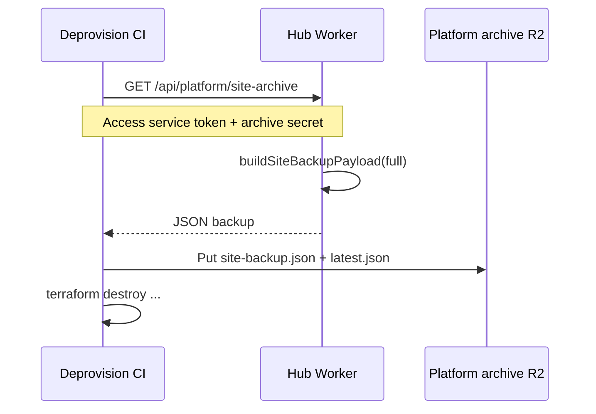

# Platform site archive (pre-deprovision backup)

Automated export of hub state **before** Terraform destroy during [platform site deprovision](./platform-provision.md#v5--automated-deprovision). Supports suspend/cancel billing flows where a customer hub is torn down and later reprovisioned with the same `site_id`.

## Goals

- Capture a **full site backup JSON** while D1 and the Worker still exist.
- Store archives in **platform R2** (not a new D1 database).
- Restore on reactivation via existing `POST /api/site/restore` or wizard step 1.
- Keep cost low: JSON is typically hundreds of KB; optional media copy is separate.

## What is archived

| Data | In JSON backup | Notes |
|------|----------------|-------|
| House Guide catalog (draft content) | Yes | Same as Settings → Download full site backup |
| Site profile, bins, pets | Yes | |
| Hub secrets (Wi‑Fi, PIN, lockbox, calendar) | Yes | Platform encrypts at rest in R2 (see below) |
| Sitter settings + scheduled stays | Yes | |
| Guide photo files (R2) | **No** (phase 1) | Listed in `uploadedMedia`; re-upload after restore |
| Appliance manual PDFs | **No** | Re-upload in Appliance Manuals app |
| Worker platform secrets | **No** | Regenerated on provision |

### Why not a D1 database for archived media?

- **Cost:** D1 charges on stored rows; large binaries belong in **R2** (cheaper object storage).
- **Phase 1:** JSON only — minimal cost, good enough for seasonal pause.
- **Phase 2 (optional):** Copy `lovely-home-guide-media-{site}` and appliance guide objects into a platform archive bucket under `{site_id}/media/` using Cloudflare R2 API during deprovision. Track keys in `{site_id}/archive-manifest.json`. No D1 required.

## Flow



## Worker endpoint

| Method | Path | Auth |
|--------|------|------|
| GET | `/api/platform/site-archive` | `X-Platform-Site-Archive-Secret` header matches Worker secret `PLATFORM_SITE_ARCHIVE_SECRET` |

- Does **not** require owner device mode (CI has no sitter cookie).
- Must be called **before** Terraform destroy removes D1.
- Blocked on demo hub (`DEMO_READ_ONLY`).

Set the same secret on every hub Worker and in GitHub Actions as `PLATFORM_SITE_ARCHIVE_SECRET`.

Also applied automatically on provision when the repo secret is set.

Uses `wrangler secret put` on live Workers; if a Worker has never been deployed (e.g. sandbox), falls back to `wrangler versions secret put` so the secret is stored for the next deploy.

**Existing Workers:** run once after adding the repo secret:

```bash
# Local (same CLOUDFLARE_API_TOKEN as deploy)
export PLATFORM_SITE_ARCHIVE_SECRET='…'
node scripts/sync-platform-site-archive-secret.mjs
```

Or use GitHub Actions → **Platform sync archive secret** (syncs all Workers, or one `--site` via workflow input).

## CI script

```bash
node scripts/archive-hub-site-backup.mjs <site_id>
```

Environment:

| Variable | Purpose |
|----------|---------|
| `PLATFORM_SITE_ARCHIVE_SECRET` | Must match hub Worker secret |
| `PLATFORM_HEALTH_CF_ACCESS_CLIENT_ID` | Access service token (edge) |
| `PLATFORM_HEALTH_CF_ACCESS_CLIENT_SECRET` | Access service token (edge) |
| `PLATFORM_ARCHIVE_R2_BUCKET` | Platform R2 bucket (Terraform `lovely-home-hub-archives`; script default if unset) |
| `CLOUDFLARE_ACCOUNT_ID` | For `wrangler r2 object put` |

Objects written:

- `{site_id}/site-backup-{exportedAt}.json` — full payload
- `{site_id}/latest.json` — pointer `{ archivedAt, objectKey, formatVersion }`

Archive is required for customer deprovision: missing `PLATFORM_SITE_ARCHIVE_SECRET` or a failed hub fetch **stops** teardown so the live hub is not destroyed without a copy. Sync GitHub secrets from Terraform state with:

```bash
node scripts/sync-platform-archive-github-secrets.mjs
```

Or GitHub Actions → **Platform sync archive GitHub secrets**.

## Restore on reactivate

1. Provision hub (same `site_id`).
2. Platform job or operator calls `POST /api/site/restore` with archived JSON (future: automated hook after provision CI).
3. Owner signs in; photos/PDFs re-uploaded if needed.

## Related

- [site-backup.md](./site-backup.md) — backup format and owner UI
- [platform-provision.md](./platform-provision.md) — deprovision workflow
