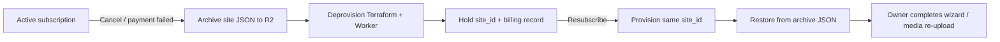

# Lovely Home Hub — roadmap

Product and platform milestones for the home dashboard (`dashboard.lovely-home.co.uk`), customer hubs on `lovely-hub.com`, and platform ops on `lovely-home.co.uk`.

**Related docs:** [customer hub playbook](./customer-hub-playbook.md) · [platform provision](./platform-provision.md) · [platform site archive](./platform-site-archive.md) · [architecture](./architecture.md)

---

## Vision

A **managed household hub** for wall tablets and remote sitters: House Guide, pet care, bins, weather, optional Alexa routines, and owner-only apps — provisioned per home on Cloudflare, with **automated sitter access** and (next) **subscription billing** so households can pause, restore, or cancel without manual ops work.

---

## Where we are (Aug 2026)

| Area | Status |
|------|--------|
| **Production home** (`dashboard.lovely-home.co.uk`) | Live; scheduled sitter stays + Access sync enabled ([#170](https://github.com/marklovely/home-dashboard/pull/170)) |
| **Platform ops** | Create → provision → wizard → deprovision validated on `practice` site |
| **Customer pilot** | `smith.lovely-hub.com` onboarded and reset-tested |
| **Demo** | `demo.lovely-home.co.uk` — public username/password, nightly reseed |
| **Sitter security** | Virtual Buttons **owner-only** in House Sitter Mode ([#168](https://github.com/marklovely/home-dashboard/pull/168)) |
| **Pre-deprovision backup** | Full site JSON to platform R2 before destroy ([#168](https://github.com/marklovely/home-dashboard/pull/169)) |
| **Billing / Stripe** | Not started — design agreed, implementation next |

---

## Shipped — timeline

Merged work is grouped by theme. PR numbers link to GitHub for detail.

### Phase 1 — Personal dashboard (Jul 2026)

Foundation for Mark’s home: PWA, widgets, Worker API, Cloudflare Access.

| Theme | Highlights | PRs |
|-------|------------|-----|
| Core app | GitHub Pages deploy, widget architecture, app shell, Settings | [#1](https://github.com/marklovely/home-dashboard/pull/1)–[#5](https://github.com/marklovely/home-dashboard/pull/5) |
| House Guide | Structured guide, CMS-style content, images, deep links | [#6](https://github.com/marklovely/home-dashboard/pull/6)–[#9](https://github.com/marklovely/home-dashboard/pull/9) |
| Worker & secrets | `/api/*`, private config, weather, controls | [#10](https://github.com/marklovely/home-dashboard/pull/10)–[#11](https://github.com/marklovely/home-dashboard/pull/11) |
| House Sitter Mode | Guest UX, deployment modes, owner PIN, device session cookie | [#12](https://github.com/marklovely/home-dashboard/pull/12)–[#26](https://github.com/marklovely/home-dashboard/pull/26) |
| Owner apps | My Day (Apple ICS), Intelligent Weather, Bin Collection | [#15](https://github.com/marklovely/home-dashboard/pull/15)–[#18](https://github.com/marklovely/home-dashboard/pull/18) |
| Security | Cloudflare Access lockdown, grouped Controls UI | [#20](https://github.com/marklovely/home-dashboard/pull/20)–[#23](https://github.com/marklovely/home-dashboard/pull/23) |

**Release:** v1.x → early v2.x (see [CHANGELOG](../CHANGELOG.md)).

---

### Phase 2 — Guide CMS, appearance, kiosk (Jul–Aug 2026)

| Theme | Highlights | PRs |
|-------|------------|-----|
| UX polish | Themes, sitter Settings nav, home zoom, control feedback | [#27](https://github.com/marklovely/home-dashboard/pull/27)–[#31](https://github.com/marklovely/home-dashboard/pull/31) |
| Guide Editor | TipTap WYSIWYG, emoji picker, appliance manuals, PDF in-page | CHANGELOG 2.1; [#114](https://github.com/marklovely/home-dashboard/pull/114) |
| Onboarding | Hub setup wizard, starter guides, in-app secrets, factory reset | CHANGELOG 2.1 |
| Backup / restore | Full site JSON export/import, encrypted backup, wizard restore path | [#109](https://github.com/marklovely/home-dashboard/pull/109)–[#111](https://github.com/marklovely/home-dashboard/pull/111), [#163](https://github.com/marklovely/home-dashboard/pull/163) |
| Test isolation | `test.lovely-home.co.uk` vanilla stack, no prod data leakage | CHANGELOG 2.1 |
| Kiosk | Session keepalive, Access re-auth banner, Fully Kiosk docs | CHANGELOG 2.1; [kiosk-tablet.md](./kiosk-tablet.md) |

---

### Phase 3 — Platform multi-site (Aug 2026)

Automated hub provisioning, platform admin UI, Terraform-managed Access.

| Theme | Highlights | PRs |
|-------|------------|-----|
| Platform admin | Site registry, wizard, D1/R2 usage, preview toggles | [#95](https://github.com/marklovely/home-dashboard/pull/95)–[#108](https://github.com/marklovely/home-dashboard/pull/108) |
| CI provision | `platform-site-provision.yml`, wrangler D1 sync, HUB_API attach | [#104](https://github.com/marklovely/home-dashboard/pull/104)–[#108](https://github.com/marklovely/home-dashboard/pull/108) |
| Bin reminders | Sitter/home banners, screensaver alerts, repeating schedules | [#83](https://github.com/marklovely/home-dashboard/pull/83), [#93](https://github.com/marklovely/home-dashboard/pull/93), [#115](https://github.com/marklovely/home-dashboard/pull/115)–[#117](https://github.com/marklovely/home-dashboard/pull/117) |
| Settings UX | Sidebar categories, prefilled home details | CHANGELOG 2.2; [#87](https://github.com/marklovely/home-dashboard/pull/87) |
| Cameras (owner) | go2rtc HTTPS setup, owner-only app | [#113](https://github.com/marklovely/home-dashboard/pull/113) |
| Marketing | Static `lovely-home.co.uk`, demo links, screenshots | [#118](https://github.com/marklovely/home-dashboard/pull/118)–[#120](https://github.com/marklovely/home-dashboard/pull/120) |
| Deprovision v5 | Terraform destroy + Worker delete + manifest refresh | [platform-provision.md](./platform-provision.md#v5--automated-deprovision) |

**Sites in registry:** `production`, `test`, `sandbox`, `demo`, `dev`, `smith`, `practice` (and others as added).

---

### Phase 4 — Demo hub & customer domain (Aug 2026)

| Theme | Highlights | PRs |
|-------|------------|-----|
| Public demo | Username/password auth, reseed cron, rate limits, marketing integration | [#121](https://github.com/marklovely/home-dashboard/pull/121)–[#128](https://github.com/marklovely/home-dashboard/pull/128) |
| `lovely-hub.com` | Customer zone, `smith` pilot, health checks with Access service token | [#129](https://github.com/marklovely/home-dashboard/pull/129)–[#134](https://github.com/marklovely/home-dashboard/pull/134) |
| Hub setup polish | Wizard flags, live validation, Ideal Postcodes address lookup | [#135](https://github.com/marklovely/home-dashboard/pull/135)–[#144](https://github.com/marklovely/home-dashboard/pull/144) |
| Demo UX | Owner/Guest toggle, configurable sitter unlock, skip Access on demo | [#147](https://github.com/marklovely/home-dashboard/pull/147)–[#148](https://github.com/marklovely/home-dashboard/pull/148) |

---

### Phase 5 — Sitter lifecycle & sell-ready ops (Aug 2026)

| Theme | Highlights | PRs |
|-------|------------|-----|
| Scheduled stays | Date-bound Cloudflare Access, extend/edit/cancel/end-now, welcome copy | [#152](https://github.com/marklovely/home-dashboard/pull/152)–[#160](https://github.com/marklovely/home-dashboard/pull/160) |
| Operator UX | Async button feedback, form validation, deploy-all Workers | [#156](https://github.com/marklovely/home-dashboard/pull/156)–[#163](https://github.com/marklovely/home-dashboard/pull/163) |
| Playbook | Customer hub runbook, practice site validation | [#164](https://github.com/marklovely/home-dashboard/pull/164), [#165](https://github.com/marklovely/home-dashboard/pull/165)–[#167](https://github.com/marklovely/home-dashboard/pull/167) |
| Wizard restore | Restore from backup on setup step 1 | [#163](https://github.com/marklovely/home-dashboard/pull/163) |
| Factory reset | Clears scheduled stays + setup secret hints | [#162](https://github.com/marklovely/home-dashboard/pull/162) |
| Platform archive | Pre-deprovision JSON backup to R2; archive secret sync scripts | [#168](https://github.com/marklovely/home-dashboard/pull/168), [#169](https://github.com/marklovely/home-dashboard/pull/169) |
| Sitter security | **No Virtual Buttons** for sitters (Worker + UI) | [#168](https://github.com/marklovely/home-dashboard/pull/168) |
| Production Access sync | Scheduled stays push **House sitters** policy on main dashboard | [#170](https://github.com/marklovely/home-dashboard/pull/170) |

**Validated by operator:** practice create → wizard → deprovision (D1/R2 cleared); production sitter OTP gated by stay window (7-day lead).

---

## Planned — Stage 3: Billing & customer lifecycle

Goal: **self-service signup → trial → paid hub → pause/cancel → restore** with minimal manual platform-admin steps.

### 3.1 Signup & trial (no card)

| Item | Notes |
|------|--------|
| Public signup API | Collect household + owner email; create platform trial record (not Stripe trial) |
| **14-day trial without card** | Provision hub immediately on signup |
| Site id / hostname allocation | `{slug}.lovely-hub.com` from registry rules |
| Post-provision wizard email | Owner lands on hub setup after DNS + Access propagate |

### 3.2 Stripe billing

| Item | Notes |
|------|--------|
| Stripe Checkout / Customer Portal | Monthly subscription; pausable/cancellable |
| Webhooks | `checkout.session.completed`, subscription updated/deleted, payment failed |
| Platform D1 (or KV) billing state | `site_id`, Stripe customer/subscription ids, trial ends, status |
| Pricing | TBD (~£12–25/month UK starting point; iterate after real conversations) |
| Smith (or practice) as billing test customer | End-to-end before public launch |

### 3.3 Suspend, cancel, restore (automated)

| Item | Notes |
|------|--------|
| Suspend | Full backup → deprovision → retain `site_id` + archive pointer |
| Resubscribe | Provision + `POST /api/site/restore` (or wizard restore) from platform R2 |
| CI hook after provision | Automated restore from `{site_id}/latest.json` (not built yet) |
| Media on restore | Phase 1: JSON only — photos/PDFs re-uploaded by owner |

---

## Planned — Stage 4: Platform polish

| Item | Priority | Notes |
|------|----------|--------|
| Archive media (phase 2) | Medium | Copy guide-media + appliance PDFs to platform R2 during deprovision |
| Sitter stay sync UX | Low | Surface Access sync errors on all stay actions (partially done [#170](https://github.com/marklovely/home-dashboard/pull/170)) |
| Hourly cron on all customer Workers | Low | Production default Worker has cron; confirm all `lovely-hub.com` envs |
| Self-service owner invite | Medium | Add/remove owner emails without Terraform |
| Stripe + platform admin UI | Medium | Site card shows trial/billing status, suspend/resume actions |
| Automated merge / PR hygiene | Low | Existing automerge workflows; expand as needed |

---

## Backlog & ideas

From [backlog.md](./backlog.md) and product discussions:

- CI visual regression for app shell layout
- Optional full guide PDF extract pipeline (`guide:extract`)
- **Cameras** as paid add-on (owner-only today; demo excludes controls/cameras)
- Migrate marketing to `.com` when ready
- Multi-property / agency dashboard (future — not scoped)
- Alexa / controls as optional paid tier

---

## How to update this doc

1. When a PR merges with user-facing or platform impact, add a line under the relevant phase (or open a small docs PR).
2. Move items from **Planned** to **Shipped** with the PR link and date.
3. Keep **Where we are** accurate for operator checkpoints (validated sites, blockers).

---

## PR index (quick reference)

| Range | Era |
|-------|-----|
| [#1](https://github.com/marklovely/home-dashboard/pull/1)–[#31](https://github.com/marklovely/home-dashboard/pull/31) | v1 dashboard foundation |
| [#81](https://github.com/marklovely/home-dashboard/pull/81)–[#120](https://github.com/marklovely/home-dashboard/pull/120) | Platform + marketing + v2.2 |
| [#121](https://github.com/marklovely/home-dashboard/pull/121)–[#148](https://github.com/marklovely/home-dashboard/pull/148) | Demo + customer hubs |
| [#149](https://github.com/marklovely/home-dashboard/pull/149)–[#170](https://github.com/marklovely/home-dashboard/pull/170) | Sitter lifecycle + archive + security |

Full list: `gh pr list --state merged --limit 200`
